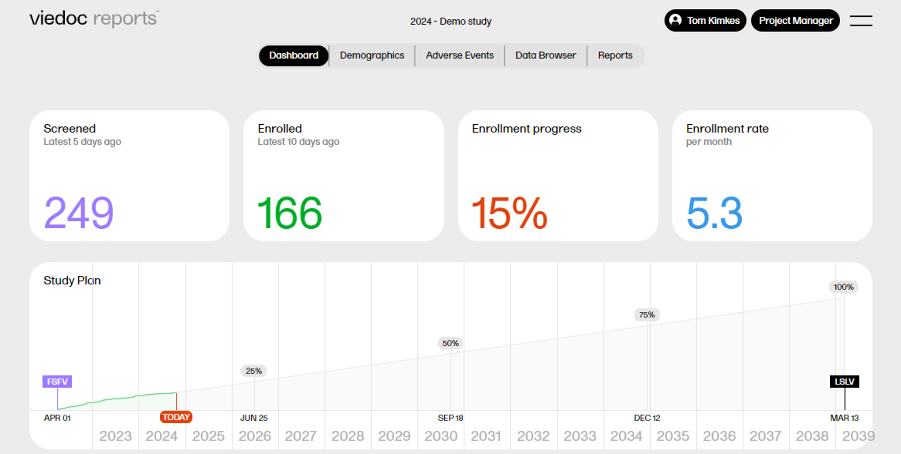
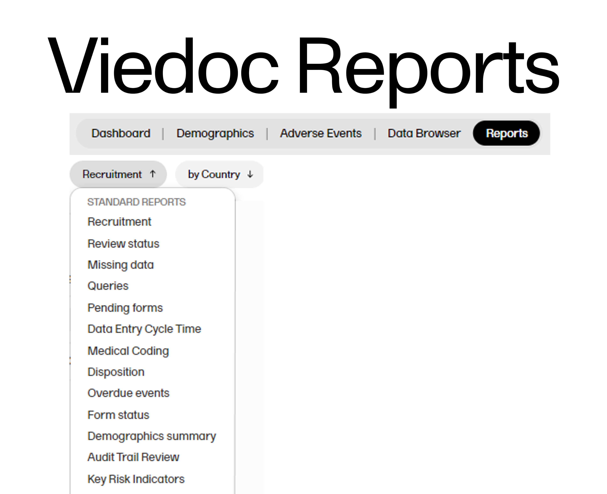

# Custom Reports for Viedoc Reports

> [!IMPORTANT]
> There have been recent changes to the packages/functions for supported within scripts for custom reports. Please review the list, including changes [here](./docs/dev-guide.md#environment)

## Contents:
- [Purpose and scope](#purpose-and-scope)
- [What are Viedoc Reports and Viedoc Custom Reports](#what-are-viedoc-reports-and-viedoc-custom-reports)
- [Overview of the repository contents](#overview-of-the-repository)
- [Changelog](#changelog)
- [Roadmap](#roadmap)

## Purpose and scope
This repository aims to provide a how-to guide for creating custom reports for use in Viedoc Reports. We also provide example report scripts and aim to provide tools for assisting with report development..

## What are Viedoc Reports and Viedoc Custom Reports
Viedoc Reports is an integrated Viedoc application for viewing and analysing study progress and performance, allowing data to be browsed and visualised in reports and graphs.

A number of dashboards and overviews can be configured in designer, and  a number of additional information regarding typical use-cases are covered in the 'Reports' section. 

However, if a bespoke visualisation is desired, custom reports can be developed.These reports are configured as a single R script, which is run on-demand to ensure up-to-date visualisations.

## Overview of the repository
- documentation: This folder contains information and resources previously contained on the [eLearning Designer User Guide](https://help.viedoc.net/c/e311e6/) article entitled "Creating custom reports".
  - [quick-start guide](./docs/quick-start.md): 
    - downloading demo data
    - setting up the local environment 
    - publishing reports
    - data availability and syncing
  - [Developing a custom report](./docs/dev-guide.md)
    - Details about input data available
    - Defining the output object
    - Environment (supported packages, blocked functions, and added functions)
  - [Additional information](./docs/quick-start.md)
    - Actions to avoid
    - Trouble shooting & common errors
- examples & use cases:
  - [Example reports](./example-reports/README.md): reports which have been developed for the [Phase II study design template](./example-reports/StudyDesign_VIEDOC-PHASE-II-TEMPLATE_2.0.xml) included in this directory. Formerly contained on the  [eLearning Designer User Guide](https://help.viedoc.net/c/e311e6/) article entitled "Custom reports examples".
  - [Functional reports](./functional-reports/README.md): reports which  can be added to any study without modification for additional monitoring functionality
  - [Graphing demos](./graphing-demos/README.md): basic examples of how to achieve certain layouts to be used as a guide when developing custom reports 
- utils: this folder contains additional tools that help in the report development and debugging process. Note that documentation for these functions is included in the [Dev guide](./docs/dev-guide.md)

## Changelog
2025-02: initial transfer of documentation and code from eLearning platform to GitHub, decisions regarding repo structure, minor updates to contents.
2025-04-04: Updated list specifiying supported packages

## Roadmap
- add information about report testing
- update/refine documentation regarding utility functions
- add troubleshooting guide
- add functional report regarding
