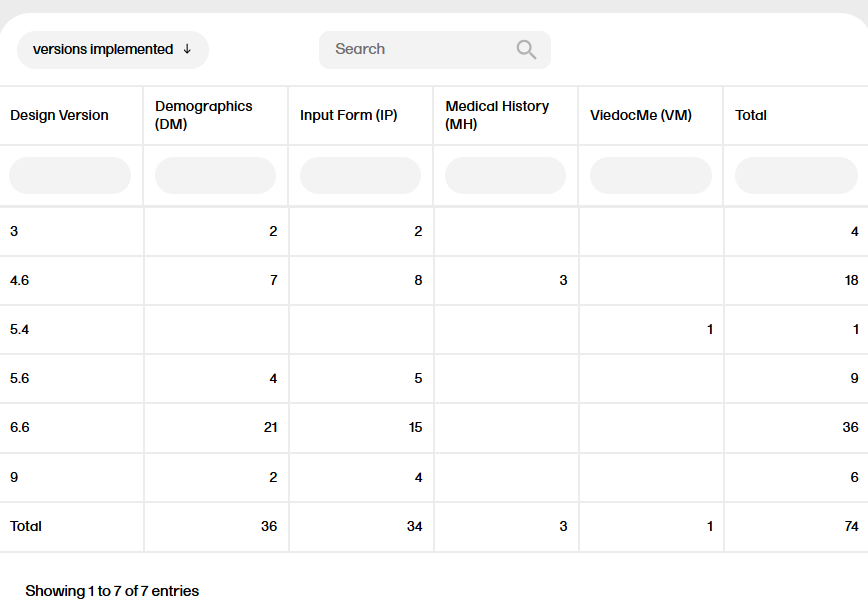

# Active Versions report
2025-02-13  Viedoc version 4.82

## Purpose
Identify all active design versions across implemented forms. 
This assists:
- designers/support when debugging issues in studies that may result from inconsistent versioning between patients, as this information is typically found in data exports which contain sensitive information. 
- administrators who will be implementing version updates or revisions.

## Source Data/required data inputs:
- `edcData`
- `metadata$FormDef`

## Output:
Creates table with showing the number of instantiated forms of each design version, where each form is a column, and each design version as a row. 

 